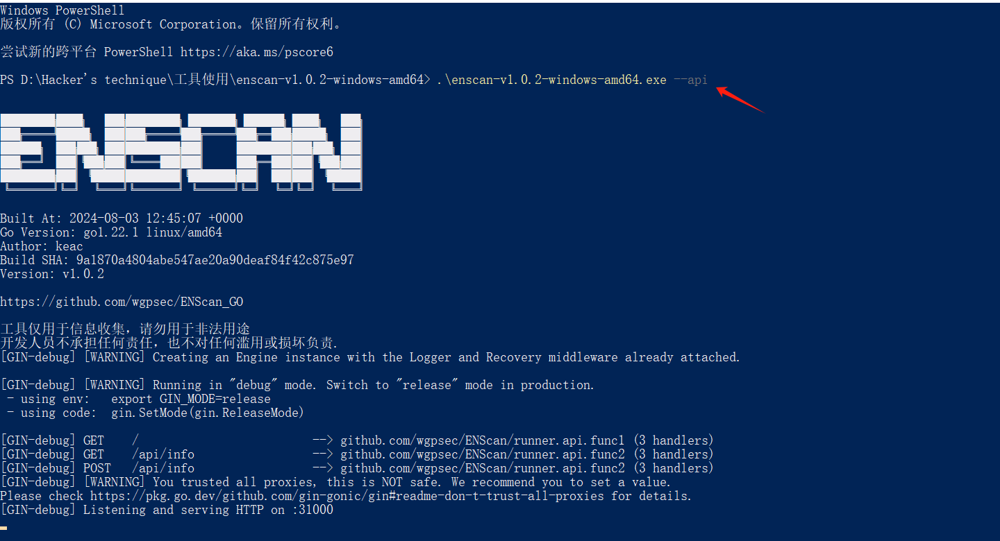
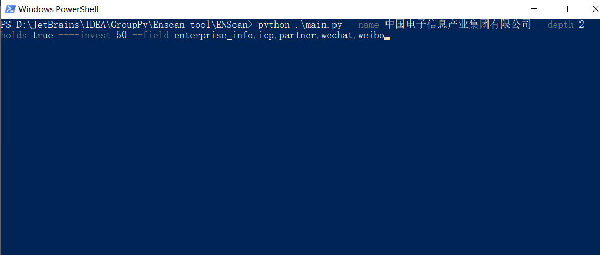
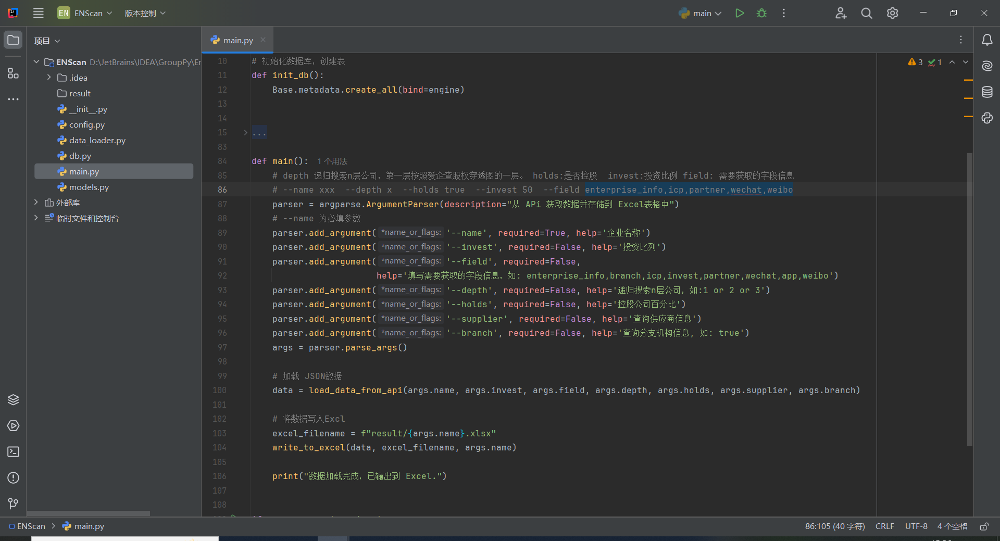

# ENScan

ENScan为ENScan_GO的二开工具，ENScan将数据转换为excl格式；ENScan_GO链接：https://github.com/wgpsec/ENScan_GO。

# 使用说明


## 配置ENScan_GO
在使用ENScan需要启动ENScan_GO的.exe文件，上方链接下载后还需要在config.xml配置token,如何配置ENScan_GO工具链接下有文档。

## 启动ENScan_GO
配置完成后启动exe文件，ENScan_GO提供了api接口，我们需要通过api方式启动，如图下,默认给出的端口为31000。



## 启动ENScan

ENScan启动就在顶级目录下的mian.py运行，需要后面接入参数如图下：



```
python main.py --name 中国电子信息产业集团有限公司 --depth 2 --holds true --invest 50 --field enterprise_info,branch,icp,invest,partner,wechat,app,weibo
```

其中 **_--name_** 为必填参数；**_--depth_** 为递归公司n级单位；**_--holds_** 为是否持股和 **_--invest_** 搭配使用； **_--invest_** 持股百分比，；**_--field_** 为选择查询的信息，如上有微信，微博等等。更多参数在mian.py方法下有说明

